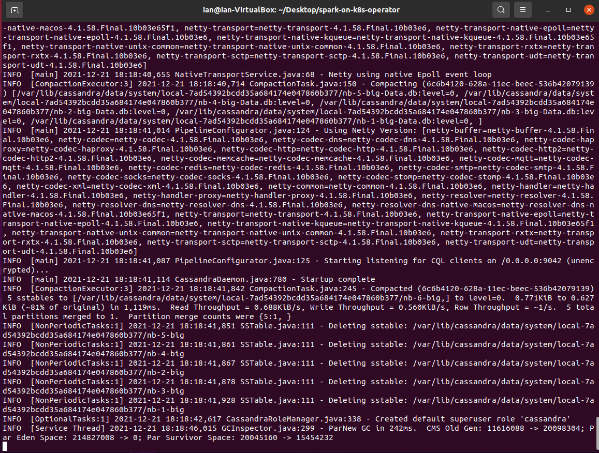
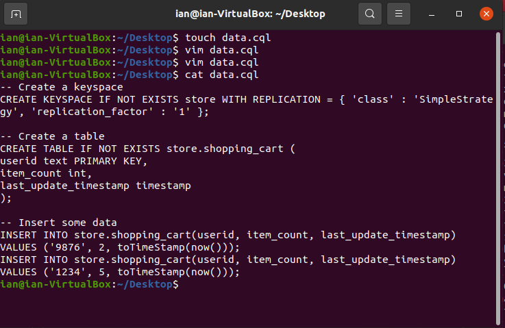
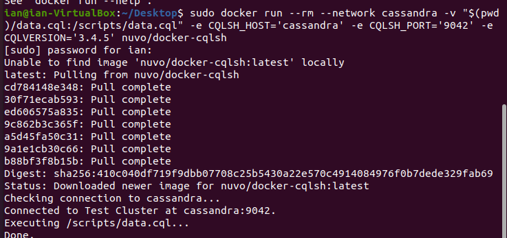
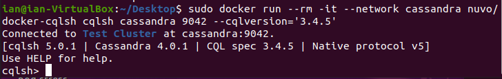
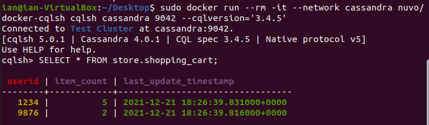
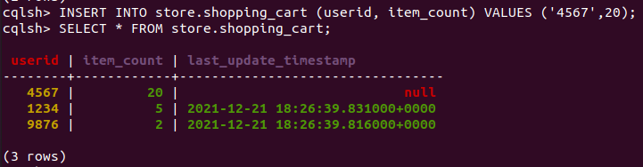
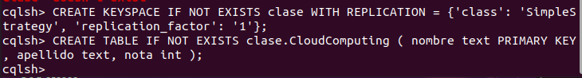
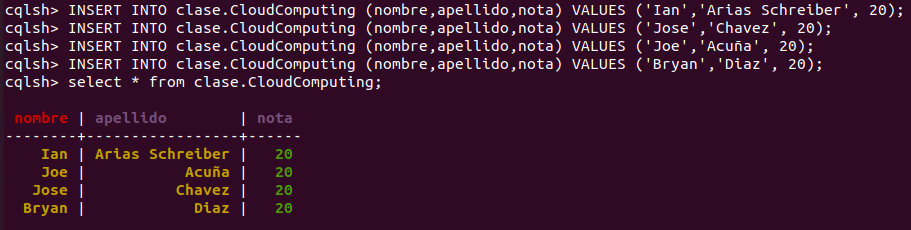

# Micro Tarea 2 - Ian Arias Schreiber - José Chavez

## Explorando Cassandra

### Inicializando Cassandra en un docker.

```
docker network create cassandra
docker run --rm --name cassandra --network cassandra --hostname cassandra cassandra
```


### Creando un archivo de comandos para ejecutar dentro de Cassandra



```
-- Create a keyspace
CREATE KEYSPACE IF NOT EXISTS store WITH REPLICATION = { 'class' : 'SimpleStrategy', 'replication_factor' : '1' };

-- Create a table
CREATE TABLE IF NOT EXISTS store.shopping_cart (
userid text PRIMARY KEY,
item_count int,
last_update_timestamp timestamp
);

-- Insert some data
INSERT INTO store.shopping_cart(userid, item_count, last_update_timestamp)
VALUES ('9876', 2, toTimeStamp(now()));
INSERT INTO store.shopping_cart(userid, item_count, last_update_timestamp)
VALUES ('1234', 5, toTimeStamp(now()));
```
### Enviando el archivo a ejecución

### Abriendo consola interactiva de CQL

#### Revisando la tabla creada con los archivos

#### Añadiendo más data

### Experimentos proprios
#### Creación de nuevo KEYSPACE "clase" y nueva tabla "CloudComputing"

![8][8.PNG)
#### Insertando data a la tabla


## Pensamientos finales
Esta micro-tarea nos permitió explorar un poco lo que es Cassandra y su lenguaje de consultas no-sql. 
A pesar de tener una arquitectura compleja, concordamos que es una base de datos intuitiva y facil de usar al momento de la creación de tablas y datos.
