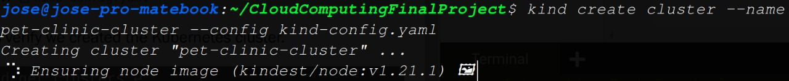
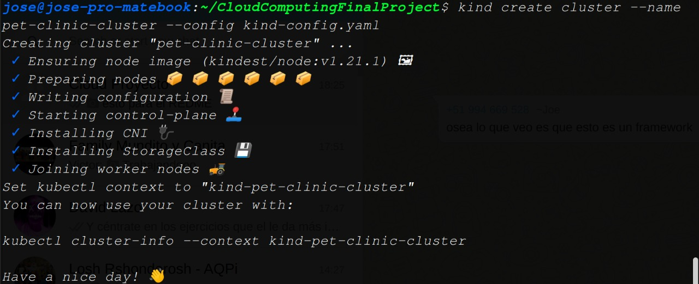
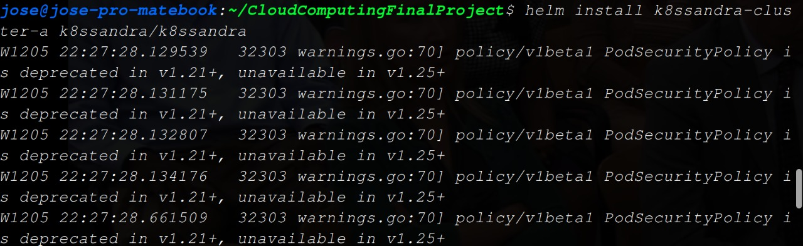
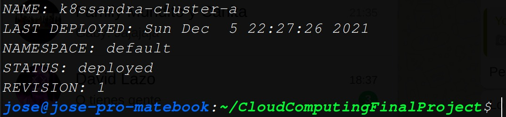

# Tarea 4

## Definir datasets

Utilizaremos un dataset [Clinica de mascotas](https://github.com/IBM/datastax-cassandra-clickstream)

## Escalar Verticalmente

Para incrementar el numero de pods, debemos configurarlo en el yaml que desplega nuestra aplicacion.

```
apiVersion: apps/v1
kind: Deployment
metadata:
  name: petclinic
  labels:
    app: petclinic
spec:
  replicas: 1
  selector:
    matchLabels:
      app: petclinic-backend
  template:
    metadata:
      labels:
        app: petclinic-backend
    spec:
      containers:
      - name: petclinic-backend
        image: "datastaxdevs/petclinic-backend"
        #command: ["tail"]
        #args: ["-f", "/dev/null"]
        env:
          - name: CASSANDRA_USER
            valueFrom:
              secretKeyRef:
                name: k8ssandra-cluster-a-superuser
                key: username
          - name: CASSANDRA_PASSWORD
            valueFrom:
              secretKeyRef:
                name: k8ssandra-cluster-a-superuser
                key: password
          - name: LISTENING_PORT
            value: "9966"
          - name: MONITORING_ENABLED
            value: "true"
          - name: MONITORING_PROMETHEUS
            value: "true"
          - name: MONITORING_METRICS
            value: "true"
          - name: MONITORING_LISTENING_PORT
            value: "9967"
          - name: DISTRIBUTED_TRACING_ENABLED
            value: "true"
          - name: DISTRIBUTED_TRACING_URL
            value: "http://tracing-server:9411"
          - name: CASSANDRA_CONTACT_POINTS
            value: "k8ssandra-cluster-a-dc1-service:9042"
          - name: CASSANDRA_LOCAL_DC
            value: "dc1"
          - name: CASSANDRA_KEYSPACE_CREATE
            value: "true"
          - name: CASSANDRA_KEYSPACE_NAME
            value: "spring_petclinic"
          - name: CASSANDRA_KEYSPACE_CQL
            value: "CREATE KEYSPACE IF NOT EXISTS spring_petclinic WITH REPLICATION = { 'class' : 'SimpleStrategy', 'replication_factor' : 1 };"

---
kind: Service
apiVersion: v1
metadata:
  name: petclinic-backend
spec:
  #type: NodePort
  selector:
    app: petclinic-backend
  ports:
  # Default port used by the image
  - port: 9966
---
apiVersion: apps/v1
kind: Deployment
metadata:
  name: petclinic-frontend
  labels:
    app: petclinic-frontend
spec:
  replicas: 1
  selector:
    matchLabels:
      app: petclinic-frontend
  template:
    metadata:
      labels:
        app: petclinic-frontend
    spec:
      containers:
      - name: petclinic-frontend
        image: "datastaxdevs/petclinic-frontend"
---
kind: Service
apiVersion: v1
metadata:
  name: petclinic-frontend
spec:
  selector:
    app: petclinic-frontend
  ports:
  - port: 8081
    targetPort: 8080
---
apiVersion: networking.k8s.io/v1
kind: Ingress
metadata:
  name: petclinic-ingress
spec:
  rules:
  - http:
      paths:
      - path: /
        pathType: Prefix
        backend:
          service:
            name: petclinic-frontend
            port:
              number: 8081
      - path: /petclinic/api
        pathType: Prefix
        backend:
          service:
            name: petclinic-backend
            port:
              number: 9966
---

```

En este caso tendremos multiples pods para cassandra y tres especificos para nuestro stack




## Escalar Horizontalmente

Para incrementar el numero de nodos, debemos especificarlo el archivo de configuracion de kindl, por ejemplo en nuestro caso:

```
kind: Cluster
apiVersion: kind.sigs.k8s.io/v1alpha3
networking:
  apiServerPort: 45451
nodes:
- role: control-plane
  image: kindest/node:v1.17.0
- role: worker
  image: kindest/node:v1.17.0
- role: worker
  image: kindest/node:v1.17.0
- role: worker
  image: kindest/node:v1.17.0
```

En este caso tendremos 4 nodos, y podemos extenderlo a cuantos neceitemos.



