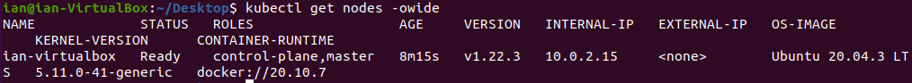
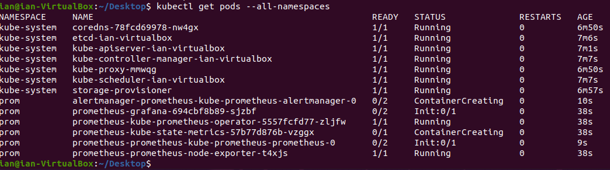
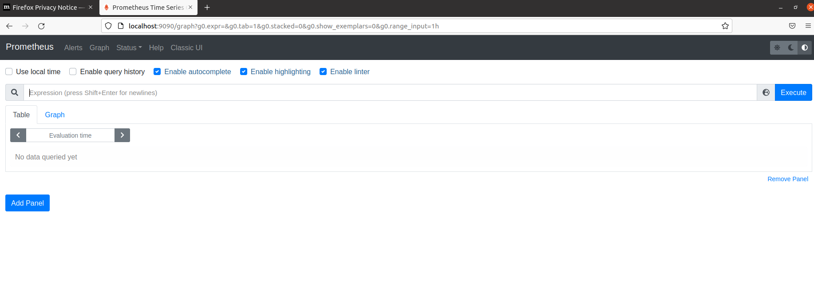
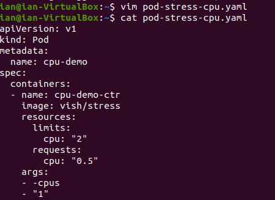
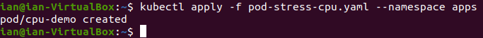
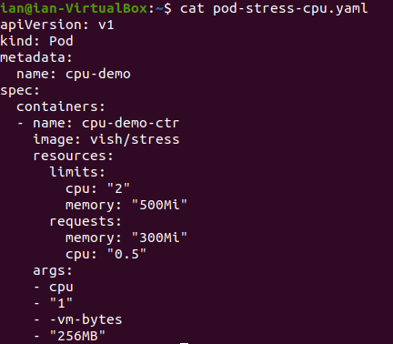
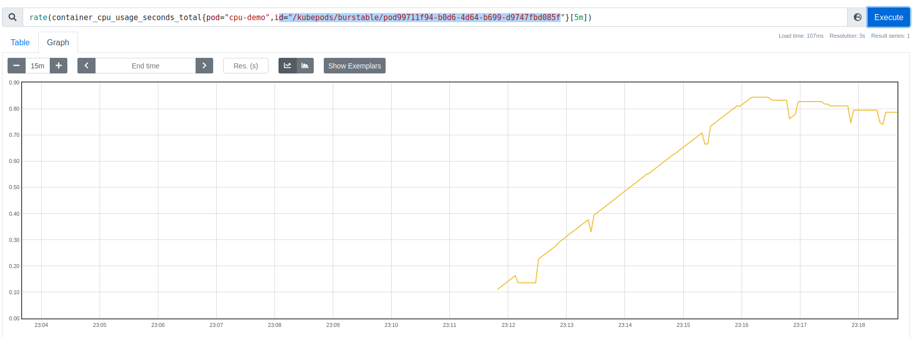
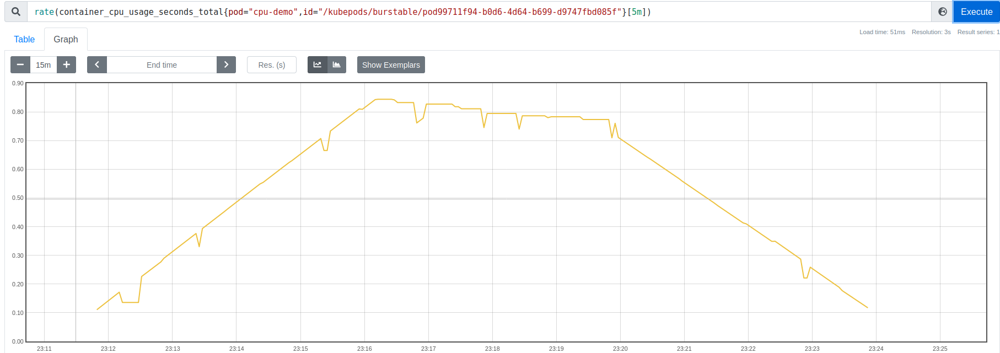
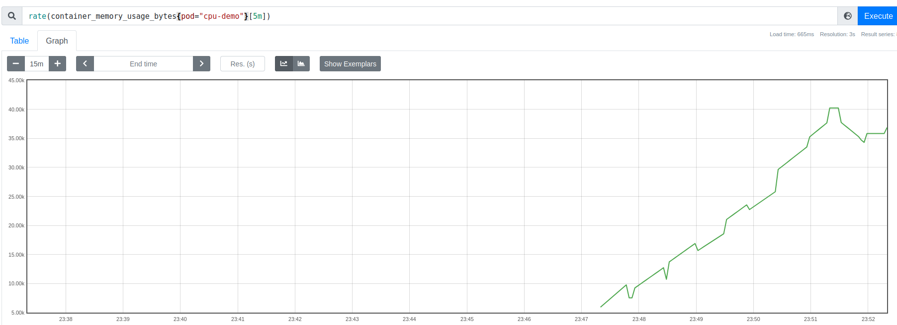
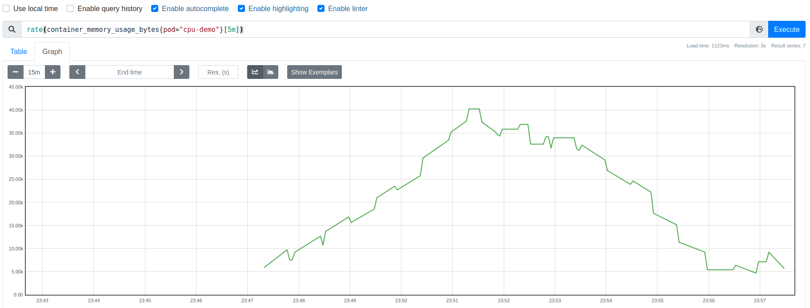


# Micro Tarea 5 - Ian Arias Schreiber y José Chavez
## Creación de Nodo Minikube
Crear nodo donde se encontrarán los pods de estrés y prometheus para el monitoreo.

## Instalar Prometheus
Instalación de prometheus usando HELM.

Dashboard de prometheus después de hacer port-forward.

## Crear Pod de estrés
Creación de pod con consumo de 1 CPU usando la imagen stress-ng.
### Consumo de CPU
#### Imagenes del dashboard

### Consumo de Memoria
Creación de pod con consumo de 250MB usando la imagen stress-ng.
#### Imagenes del dashboard

## Monitoreo
Uso del CPU desde la creación del pod de estrés hasta su deleción.
### Consumo de CPU

### Consumo de Memoria
Uso del CPU desde la creación del pod de memoria hasta su deleción.

## Pensamientos finales
Creemos que Prometheus es una herramienta fácil de instalar y además útil y rápida al momento de hacer monitoreo. Provee una amplia cantidad de consultas de monitoreo a través de su lenguaje "PromQL" como uso de CPU, Memoria, Consultas HTTPS, entre otras. Por otro lado la posible integración de Grafana con Prometheus hace que la herramienta sea aún más útil y versatil.

